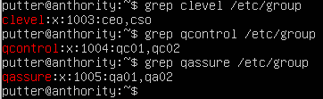

# COMOR Lab week 9 - Users and Authorization

โดยนายภควัฒณ์ พันธ์ุภักดีวงษ์ 65070165

1. ให้สร้าง User และกำหนดให้อยู่ใน Group ต่างๆต่อไปนี้เท่านั้น ใช้ `groupadd` และ `useradd`
- ceo, cso อยู่ Group clevel

```java
putter@anthority:~$ sudo groupadd clevel
putter@anthority:~$ sudo useradd -m -G clevel ceo
putter@anthority:~$ sudo useradd -m -G clevel cso
```

- qc01, qc02 อยู่ Group qcontrol

```java
putter@anthority:~$ sudo groupadd qcontrol
putter@anthority:~$ sudo useradd -m -G qcontrol qc01
putter@anthority:~$ sudo useradd -m -G qcontrol qc02
```

- qa01, qa02 อยู่ Group qassure

```java
putter@anthority:~$ sudo groupadd qassure
putter@anthority:~$ sudo useradd -m -G qassure qa01
putter@anthority:~$ sudo useradd -m -G qassure qa02
```

สามารถตรวจสอบคำสั่งได้โดยการใช้ `grep {group_name} /etc/group`



ทดสอบการให้ password ของ user ที่สร้างขึ้น


---

1. ให้สร้าง Directory แล้วกำหนดสิทธิ์ดังนี้
    - /Executive มี Owner คือ ceo และมี Group Owner คือ clevel
    
    ```java
    putter@anthority:~$ sudo mkdir /Executive
    putter@anthority:~$ sudo chown ceo:clevel /Executive
    ```
    
    - /QC_Dept มี Owner คือ qc01 และมี Group Owner คือ qcontrol
    
    ```java
    putter@anthority:~$ sudo mkdir /QC_Dept
    putter@anthority:~$ sudo chown qc01:qcontrol /QC_Dept
    ```
    
    - /QA_Dept มี Owner คือ qa01 และมี Group Owner คือ qassure
    
    ```java
    putter@anthority:~$ sudo mkdir /QA_Dept
    putter@anthority:~$ sudo chown qa01:qassure /QA_Dept
    ```
    

สามารถตรวจสอบคำสั่งได้โดยการใช้ `ls -ld {Group directory}`

```java
putter@anthority:~$ ls -ld /Executive /QC_Dept /QA_Dept
```


---

1. กำหนด Access Control Matrix ดังนี้

|  | ceo | clevel | qc01 | qcontrol | qa01 | qassure | others |
| --- | --- | --- | --- | --- | --- | --- | --- |
| /Executive | rwx | rx | - | - | - | - | - |
| /QC_Dept | - | r | rwx | rx | - | r | r |
| /QA_Dept | - | x | - | x | rwx | rx |  x |
- /Executive

```java
putter@anthority:~$ sudo setfacl -m u:ceo:rwx /Executive
putter@anthority:~$ sudo setfacl -m g:clevel:rx /Executive
```

- /QC_Dept

```java
putter@anthority:~$ sudo setfacl -m g:clevel:r /QC_Dept
putter@anthority:~$ sudo setfacl -m u:qc01:rwx /QC_Dept
putter@anthority:~$ sudo setfacl -m g:qcontrol:rx /QC_Dept
putter@anthority:~$ sudo setfacl -m g:qassure:r /QC_Dept
putter@anthority:~$ sudo setfacl -m 0:r /QC_Dept
```

- /QA_Dept

```java
putter@anthority:~$ sudo setfacl -m g:clevel:x/QA_Dept
putter@anthority:~$ sudo setfacl -m g:qcontrol:x /QA_Dept
putter@anthority:~$ sudo setfacl -m u:qa01:rwx /QA_Dept
putter@anthority:~$ sudo setfacl -m g:qassure:rx /QA_Dept
putter@anthority:~$ sudo setfacl -m 0:x /QA_Dept
```

สามารถตรวจสอบคำสั่งได้โดยการใช้  `getfacl {Group Directory}`


---

1. เวลา Login ให้แสดงข้อความต้อนรับ เช่น ถ้า ceo ทำการ Login เข้ามา จะขึ้นข้อความต้อนรับว่า Hello ceo

```java
// เพิ่มจาก file user แต่ละคน
putter@anthority:~$ sudo nano /home/ceo/.bashrc
------------------------------------------------------------------
#...
echo "Hello $USER"
------------------------------------------------------------------
putter@anthority:~$ su -s /bin/bash ceo
> Password:
> Hello ceo
```

```java
// เพิ่มจาก bash_profile 
putter@anthority:~$ sudo nano ~/.bash_profile
------------------------------------------------------------------
echo "Hello $USER"
------------------------------------------------------------------
putter@anthority:~$ su -s /bin/bash ceo
> Password:
> Hello ceo
```

หรือลองตรวจสอบการใช้งานโดยการ `exit` แล้ว login เข้ามาใหม่


---

1. ให้ทำ Backup Directory ทั้งสามข้างต้นเป็นไฟล์ Archive ชื่อ Backup.tgz หรือ Backup.tar.gz โดยการใช้ `tar czvf Backup.tar.gz {Group Directory}`


---

1. ให้เขียน Script รับข้อมูลจากผู้ใช้ดังนี้เพื่อสร้าง User แบบอัตโนมัติ
    - ชื่อที่เป็น Base
    - รหัสผ่านที่เป็น Base
    - Directory ที่จะให้สร้าง Home Directory
    - Shell ที่ต้องการใช้
    - จำนวน User ที่ต้องการ

```java
putter@anthority:~$ sudo nano create_users.sh
------------------------------------------------------------------
read -p "base name: " base_name
read -p "base password: " base_password
read -p "base directory: " base_directory
read -p "shell: " shell
read -p "num user: " num_users
for ((i=1; i<=$num_users; i++)); do
		username="${base_name}$(printf "%02d" $i)"
		password="${base_password}$(printf "%02d" $i)"
		home_directory="${base_directory}/${username}"
		useradd -m -d $home_directory -s $shell -p $password $username
		echo "Created user: $username, Password: $password, Home Directory: $home_directory, Shell: $shell"
done
------------------------------------------------------------------
putter@anthority:~$ sudo chmod +x create_users.sh
putter@anthority:~$ ./create_users.sh
```


---
