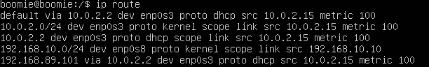
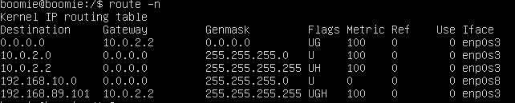

# Routing 🌐

คือ กระบวนการของการเลือกเส้นทางในการส่งข้อมูลไปมา จากโหนดนึงไปสู่โหนดนึง(คือกลุ่ม End Device ต่างๆที่มีหลายเครื่อง) โดยที่มันจะหาเส้นทางที่ดีที่สุดในการเดินทาง โดยที่ Router จะเป็นตัวจัดการว่าจะให้วิ่งทางใด เเละมีวิธีอะไรบ้าง

## ประเภทของ Routing

1. **Static Route** 
- Static Default Router - เป็น Routing Protocol ที่กําหนดค่าแบบคงที่ เช่นเดียวกับ Routing Protocol แบบ Static Route โดย Destination IP ที่ไม่มีใน Routing Table ทุก IP จะถูกส่งไปหา Router ตัวถัดไป (NextHop Address) หรือ Interface ที่ประกาศใน Default Route
- Next-Hop Static Route - เป็น IP Address ของ Router ตัวถัดไปที่เราจะเชื่อมต่อ
- Directly Connected Static Route - ต้องระบุเฉพาะ Interface output (Interface ที่แพ็กเก็ตทั้งหมดถูกส่งไปยังไฟล์เครือข่ายปลายทาง)
- Fully Specified Static Route - ต้องระบุ Interface Output (Interfaceที่แพ็กเก็ตทั้งหมดถูกส่งไปยังปลายทาง เครือข่าย) หรือ Fully Specified Static Route
1. **Dynamic Route -** เป็นการกำหนดเส้นทางโดยใช้โปรโตคอล เป็นตัวช่วยในการค้นหาเส้นทางที่ดีที่สุด ณ เวลานั้น ในการรับส่งข้อมูล (Protocol หลักๆที่มีการใช้งานกัน RIP, OSPF, EIGRP)

## Routing Tables

คือ เป็นตารางที่ใช้เพื่อหาเส้นทางที่ดีที่สุดที่จะไปถึงปลายทางนั้นๆได้ วิธีที่ทำให้เกิด Routing Table ได้ เพื่อให้ Router ใช้ในการส่งข้อมูล โดยหลักๆแล้วจะมีวิธีดังนี้ครับ ถ้าหากเป็น Network ID ของ Router เองก็จะเกิด Routing Table ได้

### ส่วนประกอบของ Routing Table มีอะไรบ้าง ?

- **Destination -** เครือข่ายหรือโฮสต์ปลายทาง
- **Gateway (via) -** เกตเวย์ที่ใช้เป็นช่องทางในการส่งข้อมูลไปยังปลายทาง
- **Netmask (Genmask) -** คือ network mask
- **Interface -** อินเทอร์เฟซที่ใช้ส่งข้อมูลไปยังเครือข่ายหรือโฮสต์ปลายทาง

### Commands ในการดู Routing Table ใน Linux

- route - คำสั่งนี้จะแสดงตารางเส้นทางทั้งหมดซึ่งรวมถึงเครือข่ายปลายทาง เส้นทาง Gateway Netmask Flags ค่า Metric และ interface
- netstat - แสดงข้อมูลที่ละเอียดมากขึ้นเหมือนกับ route แต่จะสามารถแสดงเจาะจงได้มากกว่า โดยใช้ `netstat -tuln` , `netstat -tulnc`
    
    ’-t’ แสดงเฉพาะการเชื่อมต่อ TCP
    
    ‘-u’ แสดงเฉพาะการเชื่อมต่อ UDP
    
- ip - เป็นเครื่องมือที่ใช้ในการ configuration เชิงลึกของ network interface

```markdown
route -n 
netstat -rn
ip route show

cat /proc/net/route
```

## **Installing route Command ของ netplan :**

```markdown
sudo apt-get install net-tools
```

***ตัวอย่างการใช้งาน***





## **Commands สำหรับการตั้งค่า Route**

### ADD :

```markdown
ip route add <destination_network> via <gateway_address> dev <interface>
```

- <destination_network> : ไอพีเส้นทางที่ต้องการจะเพิ่ม
- <gateway_address> : ที่อยู่ IP Gateway ที่จะใช้เป็นจุดเชื่อมต่อไปยังปลายทาง

### DELETE :

```markdown
ip route delete <destination_network>
```

### SHOW :

```markdown
ip route show
```

### CHANGE :

```markdown
ip route change <destination_network> via <gateway_address> dev <interface>
```

- <destination_network> : ไอพีเส้นทางที่ต้องการจะเปลื่ยนเส้นทาง
- <gateway_address> : ที่อยู่ IP Gateway ที่จะใช้เป็นจุดเชื่อมต่อไปยังปลายทาง

### REPLACE :

```markdown
ip route replace <destination_network> via <gateway_address> dev <interface>
```

- <destination_network> : ไอพีเส้นทางที่ต้องการจะเปลื่ยนแทน
- <gateway_address> : ที่อยู่ IP Gateway ที่จะใช้เป็นจุดเชื่อมต่อไปยังปลายทาง

### FLUSH :

```markdown
ip route flush
```

## **References** (ﾐ╹ᴥ╹ﾐ)


[https://panupong-simto.medium.com/linux-routing-เรื่องที่ผมอยากเขียนมากที่สุด-d6c705407bc6](https://panupong-simto.medium.com/linux-routing-%E0%B9%80%E0%B8%A3%E0%B8%B7%E0%B9%88%E0%B8%AD%E0%B8%87%E0%B8%97%E0%B8%B5%E0%B9%88%E0%B8%9C%E0%B8%A1%E0%B8%AD%E0%B8%A2%E0%B8%B2%E0%B8%81%E0%B9%80%E0%B8%82%E0%B8%B5%E0%B8%A2%E0%B8%99%E0%B8%A1%E0%B8%B2%E0%B8%81%E0%B8%97%E0%B8%B5%E0%B9%88%E0%B8%AA%E0%B8%B8%E0%B8%94-d6c705407bc6)

[https://www.linkedin.com/pulse/what-routing-building-tables-linux-vladimir-lebedenko](https://www.linkedin.com/pulse/what-routing-building-tables-linux-vladimir-lebedenko)[https://www.geeksforgeeks.org/route-command-in-linux-with-examples/](https://www.geeksforgeeks.org/route-command-in-linux-with-examples/)
